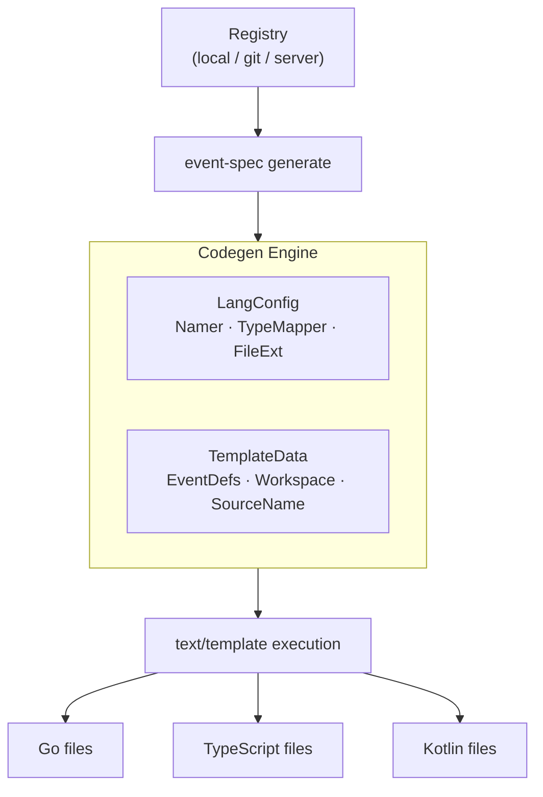

# Code Generation

The codegen layer reads event specs from the registry and generates **language-native typed wrappers** — functions, property structs, and enum constants that make typos a compile error.

## How it works

The engine uses Go's `text/template` package. Language-specific concerns (naming conventions, type mapping, import paths) live entirely inside `.tmpl` files, so adding a new language only requires a new template set.



## Naming conventions

| Language | Property naming | Type naming |
|----------|----------------|------------|
| Go | `PascalCase` | `PascalCase` |
| TypeScript | `camelCase` | `PascalCase` |
| Kotlin | `camelCase` | `PascalCase` |

Enum values follow the pattern `<EventName><PropertyName><Value>`. For example, a `category` property with value `electronics` on `product_viewed` generates:

- Go: `ProductViewedCategoryElectronics`
- TypeScript: `ProductViewedCategory.Electronics`
- Kotlin: `ProductViewedCategory.ELECTRONICS`

## Type mapping

| Spec type | Go type | TypeScript type | Kotlin type |
|-----------|---------|----------------|-------------|
| `string` | `string` | `string` | `String` |
| `number` | `float64` | `number` | `Double` |
| `integer` | `int64` | `number` | `Long` |
| `boolean` | `bool` | `boolean` | `Boolean` |
| `object` | `map[string]any` | `Record<string, unknown>` | `Map<String, Any?>` |
| `array` | `[]any` | `unknown[]` | `List<Any?>` |

Optional properties (not `required: true`) become pointer types in Go (`*string`, `*float64`) and nullable types in Kotlin (`String?`, `Double?`).

## Generated output

### Go

```
generated/
├── eventspec.go              # EventSpec struct, New() constructor
└── ecommerce/
    └── product_viewed.go     # typed method, enum consts, property struct
```

`eventspec.go`:
```go
// Code generated by event-spec. DO NOT EDIT.
package analytics

import core "github.com/dejanradmanovic/event-spec/analytics"

type EventSpec struct{ client *core.Client }

func New(client *core.Client) *EventSpec { return &EventSpec{client: client} }
```

`product_viewed.go`:
```go
// Code generated by event-spec. DO NOT EDIT.
// Source: product_viewed (v1-0-0)

type ProductViewedCategory string

const (
    ProductViewedCategoryClothing    ProductViewedCategory = "clothing"
    ProductViewedCategoryElectronics ProductViewedCategory = "electronics"
    ProductViewedCategoryOther       ProductViewedCategory = "other"
)

type ProductViewedProperties struct {
    Category  ProductViewedCategory
    ProductId string
    Currency  *string // optional
}

func (es *EventSpec) ProductViewed(
    ctx context.Context,
    props ProductViewedProperties,
    opts ...core.TrackOption,
) error {
    return es.client.Track(ctx, core.Event{
        Name: "Product Viewed",
        Properties: map[string]any{
            "category":   string(props.Category),
            "product_id": props.ProductId,
            "currency":   props.Currency,
        },
    }, opts...)
}
```

### TypeScript

```
src/analytics/generated/
├── index.ts
└── ecommerce/
    └── product_viewed.ts
```

`product_viewed.ts`:
```typescript
// Code generated by event-spec. DO NOT EDIT.
// Source: product_viewed (v1-0-0)

export enum ProductViewedCategory {
    Clothing = 'clothing',
    Electronics = 'electronics',
    Other = 'other',
}

export interface ProductViewedProperties {
    category: ProductViewedCategory;
    productId: string;
    currency?: string;
}

export function productViewed(
    client: Client,
    props: ProductViewedProperties,
): Promise<void> {
    return client.track('Product Viewed', {
        category: props.category,
        product_id: props.productId,
        currency: props.currency,
    });
}
```

### Kotlin

```
generated/
├── EventSpec.kt              # EventSpec class
└── ProductViewed.kt          # enum, data class, suspend extension fun
```

`EventSpec.kt`:
```kotlin
// Code generated by event-spec. DO NOT EDIT.

package analytics

import io.eventspec.analytics.Client

class EventSpec(internal val client: Client)
```

`ProductViewed.kt`:
```kotlin
// Code generated by event-spec. DO NOT EDIT.
// Source: product_viewed (v1-0-0)

package analytics

enum class ProductViewedCategory(val value: String) {
    CLOTHING("clothing"),
    ELECTRONICS("electronics"),
    OTHER("other"),
}

data class ProductViewedProperties(
    val category: ProductViewedCategory,
    val productId: String,
    val currency: String? = null,
)

suspend fun EventSpec.productViewed(props: ProductViewedProperties, opts: TrackOptions? = null) {
    client.track(
        Event(
            name = "Product Viewed",
            properties = mapOf(
                "category" to props.category.value,
                "product_id" to props.productId,
                "currency" to props.currency,
            ),
        ),
        opts,
    )
}
```

Usage:
```kotlin
val es = EventSpec(client)
es.productViewed(ProductViewedProperties(
    category = ProductViewedCategory.ELECTRONICS,
    productId = "SKU-123",
))
```

## Version selection

When multiple versions of an event exist in the registry, codegen selects the **latest active version** by default. A source config can pin a specific version:

```yaml title="sources/web-app.yaml"
events:
  - ecommerce/product_viewed@1-0-0   # pin to v1
  - ecommerce/**                     # latest active for everything else
```

## Supported languages

| Language | Status |
|----------|--------|
| Go | ✅ Available |
| TypeScript | ✅ Available |
| Kotlin | ✅ Available |
| Swift | ❌ Planned |
| Python | ❌ Planned |
| Rust | ❌ Planned |

## Running codegen

```bash
# With a source config
event-spec generate web-app

# Ad-hoc flags
event-spec generate --lang go --out ./generated
event-spec generate --lang typescript --out ./src/analytics/generated
event-spec generate --lang kotlin --out ./generated
```

See [CLI — generate](../cli/generate.md) for full flag documentation.
