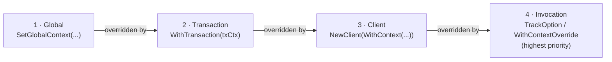

# Context Propagation

event-spec uses a **4-level context chain** to propagate identity and metadata through your application without passing arguments everywhere. Each level can override the one below it — higher levels win.

## The four levels



Non-empty fields override at each level. `Attributes` maps are **merged key-by-key** — a higher-level key wins but doesn't wipe out other keys from lower levels.

## AnalyticsContext fields

```go
type AnalyticsContext struct {
    UserID      string
    AnonymousID string
    Attributes  map[string]any
}
```

## Setting the global context

Set device/locale/app metadata once at startup:

import Tabs from '@theme/Tabs';
import TabItem from '@theme/TabItem';

<Tabs>
<TabItem value="go" label="Go">

```go
analytics.SetGlobalContext(analytics.AnalyticsContext{
    Attributes: map[string]any{
        "locale":     "en-US",
        "user_agent": r.UserAgent(),
        "app": map[string]any{
            "name":    "my-app",
            "version": "2.1.0",
        },
    },
})
```

</TabItem>
<TabItem value="ts" label="TypeScript">

```typescript
import { setGlobalContext } from '@dejanradmanovic/event-spec-api';

setGlobalContext({
    attributes: {
        locale: navigator.language,
        user_agent: navigator.userAgent,
        app: { name: 'web-app', version: APP_VERSION },
    },
});
```

</TabItem>
</Tabs>

## HTTP middleware (transaction context)

In server applications, inject user identity per-request using `WithTransaction`:

<Tabs>
<TabItem value="go" label="Go">

```go
func AnalyticsMiddleware(next http.Handler) http.Handler {
    return http.HandlerFunc(func(w http.ResponseWriter, r *http.Request) {
        txCtx := analytics.TransactionContext{
            UserID:      extractUserID(r),
            AnonymousID: extractSessionID(r),
            Attributes: map[string]any{
                "request_id": r.Header.Get("X-Request-ID"),
                "user_agent": r.UserAgent(),
            },
        }
        ctx := analytics.WithAnalyticsContext(r.Context(), txCtx)
        next.ServeHTTP(w, r.WithContext(ctx))
    })
}
```

Downstream handlers can call `client.Track(ctx, ...)` without knowing the user ID — it's already in `ctx`.

</TabItem>
<TabItem value="ts" label="TypeScript">

```typescript
// Express middleware
app.use((req, res, next) => {
    req.analyticsClient = client.withTransaction({
        userId: req.user?.id,
        anonymousId: req.session.id,
        attributes: { request_id: req.headers['x-request-id'] },
    });
    next();
});

// In a route handler:
await req.analyticsClient.track('checkout_started', { cart_value: 149.99 });
```

</TabItem>
</Tabs>

## MessageContext

When an event is dispatched, `AnalyticsContext.Attributes` are promoted into a typed `MessageContext` struct. Well-known keys map to specific fields:

| Attribute key | MessageContext field |
|--------------|---------------------|
| `user_agent` | `UserAgent` |
| `locale` | `Locale` |
| `ip_address` | `IP` |
| `app` | `App` (name, version, build) |
| `device` | `Device` (manufacturer, model, type) |
| `os` | `OS` (name, version) |
| `screen` | `Screen` (width, height, density) |
| `campaign` | `Campaign` (source, medium, name) |
| unknown keys | `Extra` map |

## Identify and context separation

`IdentifyMessage` keeps traits and context in separate buckets — they are never mixed:

| Field | What it is | Where it comes from |
|-------|------------|---------------------|
| `traits` | Who the user **is** — email, name, plan, custom properties | The `traits` argument you pass directly |
| `context` | The environment the call was made **from** — device, locale, user agent, IP | `AnalyticsContext.Attributes` from the context chain |

`buildMessageContext` is called internally on every dispatch (`track`, `identify`, `group`, `page`, `alias`) to promote well-known attribute keys (`user_agent`, `locale`, `ip_address`, `app`, `device`, `os`, etc.) into typed `MessageContext` fields. Unknown keys land in `extra` and still flow through to the provider.

### Calling identify

<Tabs>
<TabItem value="go" label="Go">

```go
err := client.Identify(ctx, "user-123", map[string]any{
    "email":      "alice@example.com",
    "name":       "Alice",
    "plan":       "pro",
    "created_at": "2026-01-15T10:00:00Z",
})
```

</TabItem>
<TabItem value="ts" label="TypeScript">

```typescript
await client.identify('user-123', {
    email: 'alice@example.com',
    name: 'Alice',
    plan: 'pro',
    createdAt: '2026-01-15T10:00:00Z',
});
```

</TabItem>
</Tabs>

The resulting message sent to every provider separates the two buckets cleanly:

```
IdentifyMessage {
    userId:      "user-123"
    anonymousId: "anon-abc"          // always from the context chain, never passed directly
    traits: {                        // your traits argument (after hooks)
        email:   "alice@example.com"
        plan:    "pro"
    }
    context: {                       // built from AnalyticsContext.Attributes
        locale:    "en-US"
        userAgent: "Mozilla/5.0 ..."
        app:       { name: "web-app", version: "2.1.0" }
    }
}
```

### Identity resolution

The `userId` positional argument is the canonical identity, but the **merged context chain takes precedence**: if a non-empty `UserID` is already present in the context (e.g. injected by `AnalyticsMiddleware` in Go or `withTransaction` in TypeScript), it wins. This means you can call `identify` from inside a middleware-wrapped handler without re-extracting the user ID:

<Tabs>
<TabItem value="go" label="Go">

```go
// AnalyticsMiddleware has already set UserID in ctx — pass "" to let context win
client.Identify(ctx, "", map[string]any{"plan": "enterprise"})
```

</TabItem>
<TabItem value="ts" label="TypeScript">

```typescript
// withTransaction has already bound userId — pass '' to let context win
const reqClient = client.withTransaction({ userId: req.user.id });
await reqClient.identify('', { plan: 'enterprise' });
```

</TabItem>
</Tabs>

Traits flow through the full hook chain (Before → providers → After/Error/Finally), so validation, sampling, and custom hooks apply exactly as they do for track events.
