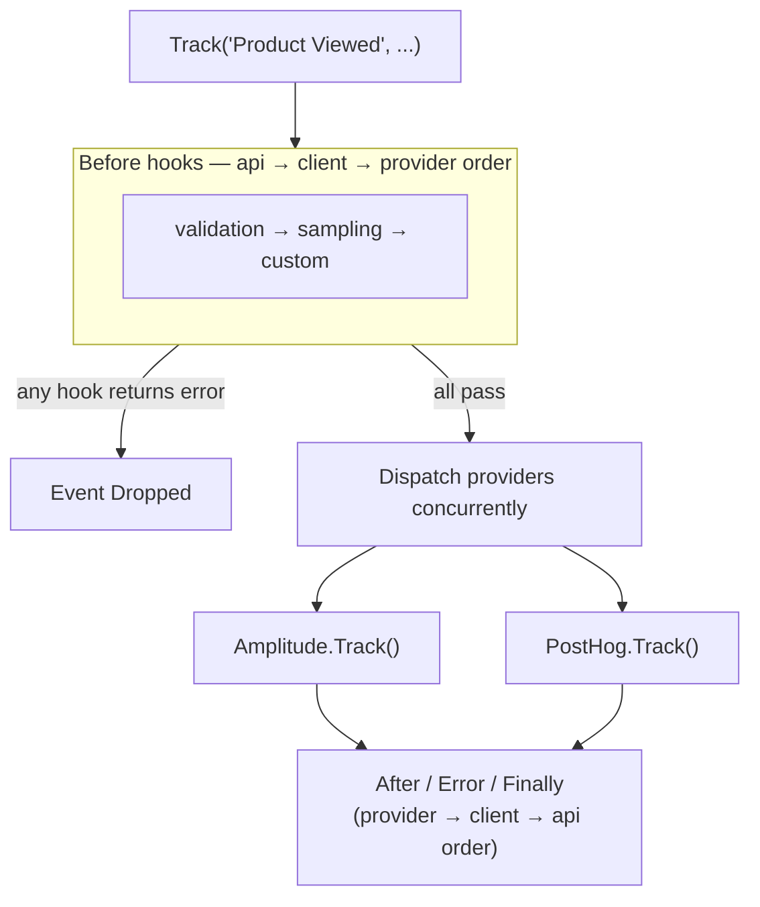

# Hooks

**Hooks** are the middleware layer for the event pipeline. They execute before and after provider dispatch, enabling cross-cutting concerns like schema validation, sampling, consent checking, PII stripping, and logging — without modifying provider code.

## Lifecycle

`Before` runs **once** and gates all providers. `After`, `Error`, and `Finally` fire **once per provider result**. The registration order is `api → client → provider` for `Before` and reversed for `After`/`Error`/`Finally`.



## The Hook interface

import Tabs from '@theme/Tabs';
import TabItem from '@theme/TabItem';

<Tabs>
<TabItem value="go" label="Go">

```go
type Hook interface {
    Before(ctx context.Context, hc HookContext, hints HookHints) (*EventEnvelope, error)
    After(ctx context.Context, hc HookContext, result HookResult, hints HookHints) error
    Error(ctx context.Context, hc HookContext, err error, hints HookHints)
    Finally(ctx context.Context, hc HookContext, result HookResult, hints HookHints)
}
```

Use `hooks.UnimplementedHook` as a base and override only the stages you need:

```go
type MyHook struct {
    hooks.UnimplementedHook
}

func (h *MyHook) Before(ctx context.Context, hc hooks.HookContext, hints hooks.HookHints) (*hooks.EventEnvelope, error) {
    // Inspect or mutate the event before dispatch
    if hc.EventName == "Product Viewed" {
        hc.Envelope.Properties["hook_applied"] = true
    }
    return hc.Envelope, nil
}
```

</TabItem>
<TabItem value="ts" label="TypeScript">

```typescript
interface Hook {
  // Return a new EventEnvelope to replace the event, null to pass through, throw to drop.
  before(hc: HookContext, hints?: HookHints): Promise<EventEnvelope | null>;
  after(hc: HookContext, result: HookResult, hints?: HookHints): Promise<void>;
  error(hc: HookContext, err: Error, hints?: HookHints): void;
  finally(hc: HookContext, result: HookResult, hints?: HookHints): void;
}
```

Extend `UnimplementedHook` and override only the stages you need:

```typescript
class MyHook extends UnimplementedHook {
  async before(hc: HookContext, hints?: HookHints): Promise<EventEnvelope | null> {
    // Inspect or mutate the event before dispatch
    if (hc.eventName === 'Product Viewed') {
      return { ...hc.message as EventEnvelope, properties: { ...(hc.message as EventEnvelope).properties, hook_applied: true } };
    }
    return null; // pass through unchanged
  }
}
```

</TabItem>
</Tabs>

## HookContext

`HookContext` is passed to every hook stage:

| Field | Type | Description |
|-------|------|-------------|
| `Operation` | `string` | `"track"`, `"identify"`, etc. |
| `EventName` | `string` | The event name |
| `Context` | `AnalyticsContext` | Merged context chain at time of call |
| `Envelope` | `*EventEnvelope` | Mutable event (Before only) |
| `Provider` | `ProviderMetadata` | Which provider this result is for (After/Error/Finally) |

## EventEnvelope

`EventEnvelope` is the mutable event representation passed through `Before` hooks. Modifying it affects what all providers receive:

<Tabs>
<TabItem value="go" label="Go">

```go
type EventEnvelope struct {
    Name       string
    Properties map[string]any
    // ... identity fields
}
```

Returning an error from `Before` cancels dispatch entirely and marks the event as `Dropped`.

</TabItem>
<TabItem value="ts" label="TypeScript">

```typescript
interface EventEnvelope {
  eventName: string;
  properties: Record<string, unknown>;
  context: AnalyticsContext;
  metadata?: Record<string, unknown>;
}
```

Throwing from `before()` cancels dispatch entirely and marks the event as `Dropped`. Return `null` to pass through unchanged, or return a new `EventEnvelope` to replace the event for all subsequent hooks and providers.

</TabItem>
</Tabs>

## Registering hooks

Hooks can be registered at three scopes:

<Tabs>
<TabItem value="go" label="Go">

```go
// API-level (applies to all clients)
analytics.AddGlobalHook(myHook)

// Client-level
client := analytics.NewClient(
    analytics.WithHooks(validation.New(lookup), sampling.New(samplingHook)),
)

// Provider-level (from Provider.Hooks())
```

</TabItem>
<TabItem value="ts" label="TypeScript">

```typescript
// API-level (applies to all clients)
addGlobalHooks(myHook);

// Client-level
const client = new Client({
  hooks: [new ValidationHook(lookup), new SamplingHook(samplingHook)],
});

// Provider-level (from provider.hooks())
```

</TabItem>
</Tabs>

## Built-in hooks

| Hook | Package | Status |
|------|---------|--------|
| [Schema validation](../hooks/validation.md) | `hooks/validation` | ✅ Available |
| [Sampling](../hooks/sampling.md) | `hooks/sampling` | ✅ Available |
| Structured logging | `hooks/logging` | ❌ Planned |
| OpenTelemetry spans | `hooks/otel` | ❌ Planned |

## Writing a custom hook

See [Hooks — Custom](../hooks/custom.md).
