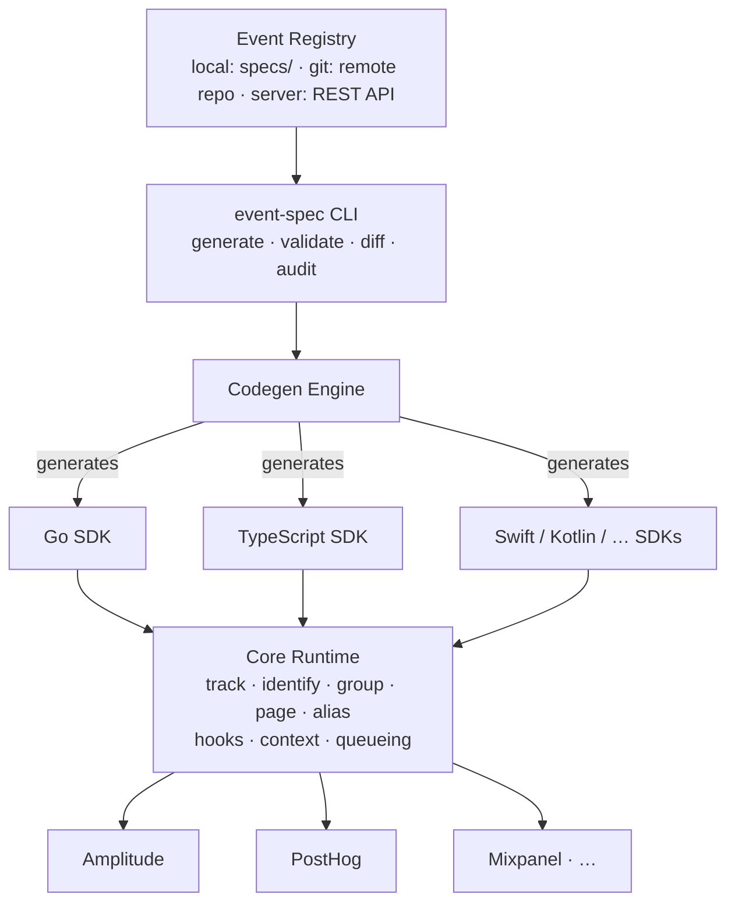

# What is event-spec?

event-spec is a **provider-agnostic analytics abstraction platform**. It lets you define your analytics events once — in YAML — and ship them to any analytics backend without coupling your application code to a specific vendor.

## The problem it solves

Most teams instrument analytics by calling a vendor SDK directly:

```typescript
// Tightly coupled to Amplitude
amplitude.track('Product Viewed', { product_id: 'SKU-123', category: 'electronics' });
```

This creates three compounding problems:

- **Vendor lock-in** — Swapping from Amplitude to PostHog means rewriting every track call.
- **No schema enforcement** — A typo in `product_id` silently sends bad data; you find out weeks later in a dashboard.
- **No shared contract** — Mobile, web, and backend teams each instrument the same event differently.

## The four-layer architecture

event-spec addresses this through four architectural layers:



| Layer | What it does |
|-------|-------------|
| **Event Contract** | YAML event specs with versioning (SchemaVer), JSON Schema validation, and breaking-change detection |
| **SDK Runtime** | Pluggable analytics destinations behind a stable `Provider` interface. Hook lifecycle, context propagation, queueing, retry, and dispatch |
| **Codegen** | Reads the event registry and generates language-native typed wrappers — functions, enums, and property structs |
| **Governance / Operations** | Registry server with REST API, audit tooling (AST-based event usage scanning), and catalog generation |

## Key properties

- **No vendor lock-in** — swap a provider by changing one line of config; no application code changes
- **Type safety** — generated wrappers make mistyped property names a compile error
- **Schema enforcement** — the validation hook rejects events that don't match their YAML contract at runtime
- **Multi-provider** — send the same event to Amplitude and PostHog simultaneously; hooks run once, delivery is parallel
- **Deterministic sampling** — user-id-hash sampling means a user is either always sampled or never sampled, across services

## Status

event-spec is in **alpha**. The core runtime, codegen, CLI, and registry are functional. See the [README](https://github.com/dejanradmanovic/event-spec#status) for the complete component status table.

## Next steps

- [Installation](./installation.md) — install the CLI and SDK packages
- [Quickstart](./quickstart.md) — write your first event spec and generate typed wrappers in 5 minutes
