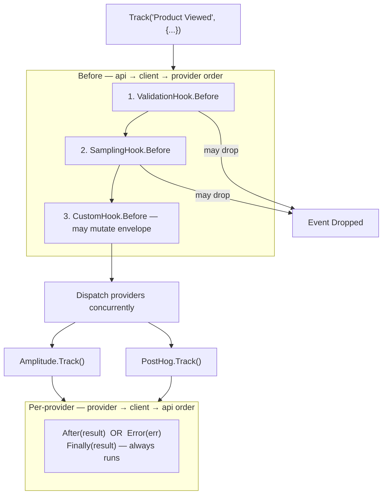

# Hooks Overview

Hooks are the middleware layer for event-spec's event pipeline. They execute at four lifecycle stages around provider dispatch, enabling cross-cutting concerns like validation, sampling, consent, PII stripping, and observability without touching provider code.

## Execution order



`Before` runs **once** for all providers. A non-nil error return from any `Before` hook cancels the entire dispatch and marks the event as `Dropped`.

`After`, `Error`, and `Finally` run **once per provider result** in reverse registration order.

## Base type

Use `UnimplementedHook` as a base to get no-op implementations of all four stages, then override only the ones you need:

import Tabs from '@theme/Tabs';
import TabItem from '@theme/TabItem';

<Tabs>
<TabItem value="go" label="Go">

```go
type MyHook struct {
    hooks.UnimplementedHook
}
```

</TabItem>
<TabItem value="ts" label="TypeScript">

```typescript
class MyHook extends UnimplementedHook {
  // override only the stages you need
}
```

</TabItem>
</Tabs>

## Registering hooks

<Tabs>
<TabItem value="go" label="Go">

```go
// Client-level hooks
client := analytics.NewClient(
    analytics.WithHooks(
        validation.New(lookup),
        sampling.New(cfg),
    ),
)

// API-level (applies to all clients)
analytics.AddGlobalHook(myCustomHook)
```

</TabItem>
<TabItem value="ts" label="TypeScript">

```typescript
// Client-level hooks
const client = new Client({
  hooks: [new ValidationHook(lookup), new SamplingHook(cfg)],
});

// API-level (applies to all clients)
addGlobalHooks(myCustomHook);
```

</TabItem>
</Tabs>

## Built-in hooks

| Hook | Package | Status |
|------|---------|--------|
| [Sampling](./sampling.md) | `hooks/sampling` | ✅ Available |
| [Validation](./validation.md) | `hooks/validation` | ✅ Available |
| Logging | `hooks/logging` | ❌ Planned |
| OpenTelemetry | `hooks/otel` | ❌ Planned |

## Custom hooks

See [Custom Hooks](./custom.md) for a full walkthrough of writing and registering your own hook.
