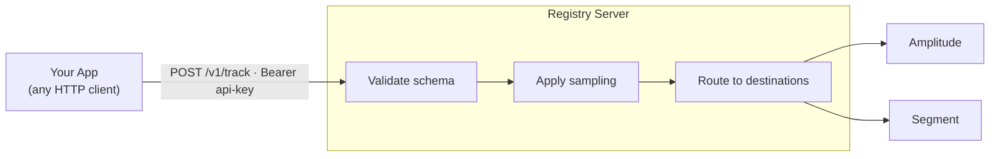

# Analytics Relay

The relay is the server's most powerful feature. Applications send raw events over HTTP; the server validates them against the registered event spec, applies per-event sampling rules, and forwards to all configured providers. **No provider SDKs, no provider API keys, and no provider knowledge are needed in the application.**



Changing providers or credentials requires no application redeployment — update a destination config on the server and all apps pick it up immediately.

## Setup

**1. Register a source (app)**

Create a source definition declaring which destinations receive its events:

```yaml title="apps/web-app.yaml"
name: web-app
platform: web
language: typescript
events:
  - ecommerce/**
destinations:
  - amplitude-prod
  - segment-prod
```

```bash
event-spec admin apps create apps/web-app.yaml
```

**2. Register destinations**

Configure provider credentials on the server — never in the application:

```yaml title="destinations/amplitude-prod.yaml"
name: amplitude-prod
provider: amplitude
config:
  api_key: "${AMPLITUDE_API_KEY}"
```

```bash
event-spec admin destinations create destinations/amplitude-prod.yaml
```

**3. Create an API key for the app**

```bash
event-spec admin keys create --role publisher --name "web-app-prod"
```

The key value is printed once — store it in the app's environment.

**4. Send events**

The app needs only an HTTP client and the API key:

```http
POST https://relay.example.com/v1/track
Authorization: Bearer <api-key>
Content-Type: application/json

{
  "source": "web-app",
  "event_name": "product_viewed",
  "properties": { "product_id": "SKU-123", "price": 49.99 },
  "context": { "user_id": "user-456" }
}
```

See [API Reference — Analytics relay](./api-reference.md#analytics-relay) for full endpoint and request schema documentation.

## Context object

The `context` field is common to all relay endpoints:

| Field | Type | Description |
|-------|------|-------------|
| `user_id` | string | Authenticated user identifier |
| `anonymous_id` | string | Pre-authentication device/session identifier |
| `attributes` | object | Freeform key-value context (app version, locale, etc.) |

### Automatic enrichment

The server fills in missing context attributes from the HTTP request when the client omits them:

| Attribute | Source |
|-----------|--------|
| `user_agent` | `User-Agent` header |
| `ip_address` | `X-Forwarded-For`, then `RemoteAddr` |

Client-supplied values always win over server-extracted values. Thin clients (browser, mobile) can omit these attributes and the server captures them automatically.

## Server-side hooks

Two hooks run on every inbound event before it reaches providers:

**Validation** — checks the event name and properties against the registered event spec. Events with missing required fields, wrong types, or `status: deleted` are rejected with `400 Bad Request`. Unknown event names pass through by default.

**Sampling** — applies the per-event `sampling` config from the spec. Sampled-out events return `202 Accepted` and are silently discarded without reaching providers.

Both hooks are toggled by the [`hooks_enabled`](./configuration.md#hooks_enabled) config flag.

## Source → destination routing

Each source lists its destination names. When an event arrives:

1. The server looks up the source by the `source` field in the request body.
2. It retrieves the source's `destinations` list from the database.
3. It builds (or retrieves from cache) an analytics client with one provider per destination.
4. The event is dispatched to all providers.

Updating a source's destination list takes effect on the next event — the per-source client cache is invalidated automatically.
