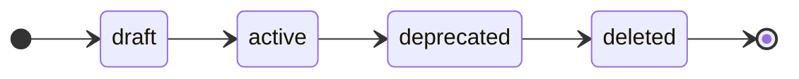

# Event Spec Reference

Full field reference for event spec YAML files.

## File location

```
specs/<namespace>/<event_name>/<version>.yaml
```

## Top-level fields

| Field | Type | Required | Description |
|-------|------|----------|-------------|
| `$schema` | string | Yes | Schema identifier. Use `"https://event-spec.io/schemas/event/v1"`. |
| `name` | string | Yes | Machine-readable event name in `snake_case`. |
| `display_name` | string | Yes | Human-readable name shown in the catalog. |
| `version` | string | Yes | SchemaVer string: `MAJOR-MINOR-PATCH` (e.g. `1-0-0`). |
| `status` | string | Yes | Lifecycle status: `draft` \| `active` \| `deprecated` \| `deleted`. |
| `namespace` | string | Yes | Logical grouping. Must match the directory name. |
| `type` | string | Yes | Analytics call type: `track` \| `identify` \| `group` \| `page` \| `alias`. |
| `event_name` | string | Yes | The exact string sent to analytics providers (e.g. `"Product Viewed"`). |
| `description` | string | No | Documentation string shown in the catalog. |
| `properties` | map | No | Property definitions (see below). |
| `hooks` | object | No | Per-event hook config overrides (see below). |
| `tags` | list[string] | No | Arbitrary tags for filtering in the registry. |

## Property fields

Each key in `properties` is the property name (in `snake_case`). The value is a property definition:

| Field | Type | Required | Description |
|-------|------|----------|-------------|
| `type` | string | Yes | `string` \| `number` \| `integer` \| `boolean` \| `object` \| `array` |
| `required` | bool | No | Whether the property must be present. Default: `false`. |
| `description` | string | No | Documentation string. |
| `enum` | list | No | Allowed values. Generated as typed enum constants. |
| `pattern` | string | No | Regex pattern (string type only). |
| `minimum` | number | No | Minimum value (number / integer types only). |
| `maximum` | number | No | Maximum value (number / integer types only). |
| `default` | any | No | Default value used in documentation and catalog. Not enforced at runtime. |
| `aliases` | list[string] | No | Alternative property names (for ingestion normalization). |

## Status lifecycle



| Status | `validate` behavior | Codegen | Audit |
|--------|--------------------|---------|----|
| `draft` | Validated (no warning) | Included | Included |
| `active` | Validated strictly | Included | Included |
| `deprecated` | Warning emitted; error with `--strict` | Included | Included |
| `deleted` | Warning emitted; error with `--strict` | Excluded | Excluded |

## Hook config

Per-event hook overrides — these override the hook's global defaults for this specific event:

```yaml
hooks:
  sampling:
    strategy: user_id_hash    # user_id_hash | random
    rate: 0.5                 # 0.0–1.0

  validation:
    mode: strict              # strict | warn
```

## SchemaVer bump rules

See [Concepts — Event Contract](../concepts/event-contract.md#versioning-schemaver) for the full breaking-change table.

## Complete example

```yaml
$schema: "https://event-spec.io/schemas/event/v1"
name: checkout_completed
display_name: "Checkout Completed"
version: "2-1-0"
status: active
namespace: ecommerce
type: track
event_name: "Checkout Completed"
description: "Fired when a user completes the checkout flow and the order is confirmed."
tags: [revenue, critical]

properties:
  order_id:
    type: string
    required: true
    description: "Unique order identifier"
  total:
    type: number
    required: true
    minimum: 0
    description: "Order total in the given currency"
  currency:
    type: string
    required: false
    default: "USD"
    pattern: "^[A-Z]{3}$"
    description: "ISO 4217 currency code"
  items:
    type: array
    required: true
    description: "Line items in the order"
  payment_method:
    type: string
    required: false
    enum: [credit_card, paypal, apple_pay, google_pay, bank_transfer]
  coupon_code:
    type: string
    required: false

hooks:
  validation:
    mode: strict
  sampling:
    strategy: random
    rate: 1.0   # always sample revenue events
```
